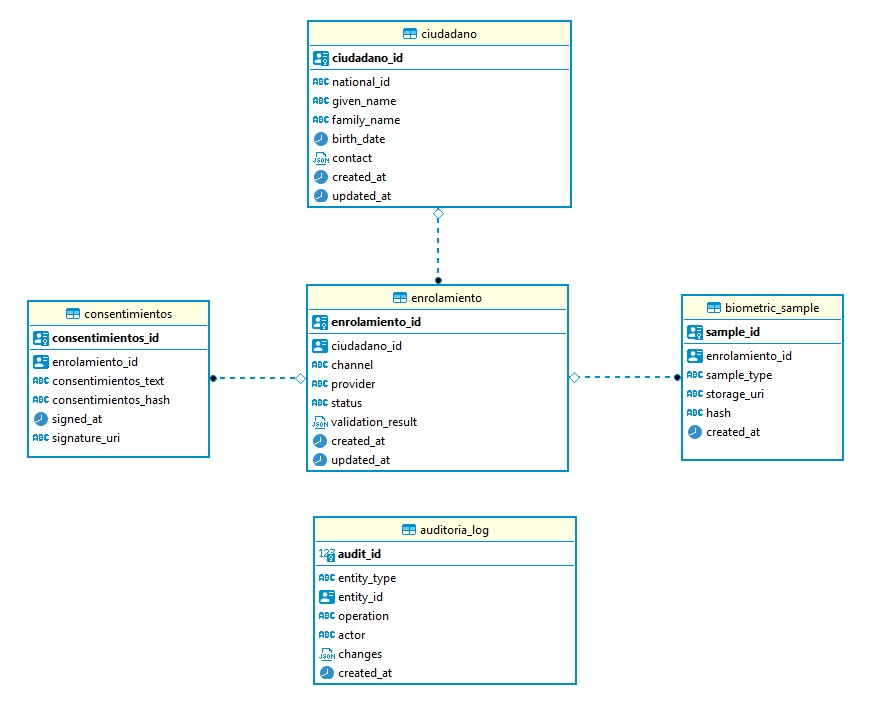

[Regresar al Inicio](README.md)

### 📚 Diccionario de Datos — Plataforma de Enrolamiento Ciudadano
Este diccionario describe las tablas principales del sistema, su propósito, componentes y cómo se relacionan entre sí. Está orientado a desarrolladores, analistas y arquitectos de datos.

## 1️⃣ Tabla citizen — Ciudadanos
**Propósito:**
Almacenar la información biográfica de cada ciudadano que se registra en la plataforma. Sirve como la entidad central de identidad.

| Columna       | Tipo          | Descripción                                               | Notas                                                               |
| ------------- | ------------- | --------------------------------------------------------- | ------------------------------------------------------------------- |
| `citizen_id`  | `uuid`        | Identificador único del ciudadano                         | Se genera automáticamente con `uuid_generate_v4()`. Clave primaria. |
| `national_id` | `varchar(50)` | Número de documento nacional o identificación única       | Único por ciudadano, índice para búsqueda rápida.                   |
| `given_name`  | `text`        | Nombre(s) del ciudadano                                   | Obligatorio.                                                        |
| `family_name` | `text`        | Apellido(s) del ciudadano                                 | Obligatorio.                                                        |
| `birth_date`  | `date`        | Fecha de nacimiento                                       | Opcional pero útil para validaciones de edad.                       |
| `contact`     | `jsonb`       | Información de contacto (teléfono, email) en formato JSON | Permite almacenar múltiples contactos sin normalización estricta.   |
| `created_at`  | `timestamptz` | Fecha y hora de creación del registro                     | Se asigna automáticamente.                                          |
| `updated_at`  | `timestamptz` | Fecha y hora de la última actualización                   | Actualizable en modificaciones.                                     |

**Consideraciones:**
- RLS (Row Level Security) habilitado para proteger información sensible (PII).
- Extensiones: pgcrypto y uuid-ossp permiten manejo de UUIDs seguros y hashes si se requiere.

### 2️⃣ Tabla enrollment — Enrolamiento
**Propósito:**
Registrar cada proceso de enrolamiento ciudadano. Relaciona un ciudadano con su intento de enrolamiento, el canal de registro y el estado de validación.

| Columna             | Tipo           | Descripción                                      | Notas                                                                 |
| ------------------- | -------------- | ------------------------------------------------ | --------------------------------------------------------------------- |
| `enrollment_id`     | `uuid`         | Identificador único del enrolamiento             | Clave primaria.                                                       |
| `citizen_id`        | `uuid`         | Referencia al ciudadano                          | FK a `citizen(citizen_id)`, eliminación en cascada.                   |
| `channel`           | `varchar(20)`  | Canal de registro                                | Ej: web, mobile, API.                                                 |
| `provider`          | `varchar(100)` | Entidad que facilita la validación               | Opcional, útil para integraciones externas.                           |
| `status`            | `varchar(20)`  | Estado del enrolamiento                          | Ej: pending, validated, rejected. Indexado para consultas frecuentes. |
| `validation_result` | `jsonb`        | Resultado de validaciones automáticas o externas | Permite almacenar múltiples reglas y mensajes.                        |
| `created_at`        | `timestamptz`  | Fecha de creación                                | Automático.                                                           |
| `updated_at`        | `timestamptz`  | Fecha de última actualización                    | Actualizable según cambios de estado.                                 |

**Consideraciones:**
- Index en status para acelerar reportes y dashboards.
- Permite trazabilidad completa de cada intento de enrolamiento.

### 3️⃣ Tabla biometric_sample — Muestras biométricas
**Propósito:**
Almacenar metadatos de muestras biométricas (huella, rostro). Los datos binarios reales se guardan en almacenamiento seguro (Blob Storage cifrado).

| Columna         | Tipo          | Descripción                             | Notas                                                     |
| --------------- | ------------- | --------------------------------------- | --------------------------------------------------------- |
| `sample_id`     | `uuid`        | Identificador único de la muestra       | Clave primaria.                                           |
| `enrollment_id` | `uuid`        | Referencia al enrolamiento              | FK a `enrollment(enrollment_id)`, eliminación en cascada. |
| `sample_type`   | `varchar(20)` | Tipo de muestra                         | Ej: fingerprint, face.                                    |
| `storage_uri`   | `text`        | Ruta al archivo cifrado en Blob Storage | Se utiliza AWS S3 / Azure Blob con KMS para cifrado.      |
| `hash`          | `text`        | Hash SHA256 del blob                    | Permite verificar integridad.                             |
| `created_at`    | `timestamptz` | Fecha de creación de la muestra         | Automático.                                               |

**Consideraciones:**
- Index sobre enrollment_id para relacionar rápido con el enrolamiento.
- No se almacenan datos biométricos en la base, solo metadatos.

### 4️⃣ Tabla consent — Consentimientos
**Propósito:**
Registrar los consentimientos informados firmados por el ciudadano durante el enrolamiento.

| Columna         | Tipo          | Descripción                            | Notas                                                 |
| --------------- | ------------- | -------------------------------------- | ----------------------------------------------------- |
| `consent_id`    | `uuid`        | Identificador único del consentimiento | Clave primaria.                                       |
| `enrollment_id` | `uuid`        | Referencia al enrolamiento             | FK a `enrollment(enrollment_id)`.                     |
| `consent_text`  | `text`        | Texto del consentimiento               | Lo que el ciudadano acepta.                           |
| `consent_hash`  | `text`        | Hash del consentimiento firmado        | Permite verificar integridad.                         |
| `signed_at`     | `timestamptz` | Fecha y hora de la firma               | Se registra automáticamente o por validación externa. |
| `signature_uri` | `text`        | Ruta al archivo de firma digital       | Archivo seguro, puede residir en S3/Blob cifrado.     |

**Consideraciones:**
- Trazabilidad completa del consentimiento.
- Cumple con normativa de protección de datos.

### 5️⃣ Tabla audit_log — Auditoría
**Propósito:**
Registrar todas las operaciones relevantes sobre las entidades críticas, para trazabilidad, seguridad y cumplimiento normativo.

| Columna       | Tipo           | Descripción                                 | Notas                                            |
| ------------- | -------------- | ------------------------------------------- | ------------------------------------------------ |
| `audit_id`    | `BIGSERIAL`    | Identificador incremental de auditoría      | Clave primaria.                                  |
| `entity_type` | `varchar(50)`  | Tipo de entidad afectada                    | Ej: citizen, enrollment, consent.                |
| `entity_id`   | `uuid`         | Identificador de la entidad afectada        | FK implícita, se usa para correlacionar cambios. |
| `operation`   | `varchar(10)`  | Operación realizada                         | Ej: INSERT, UPDATE, DELETE.                      |
| `actor`       | `varchar(100)` | Usuario o servicio que realizó la operación | Ej: admin, lambda function.                      |
| `changes`     | `jsonb`        | Detalle de cambios realizados               | Incluye campos antes y después (old/new).        |
| `created_at`  | `timestamptz`  | Fecha y hora de la operación                | Automático.                                      |

**Consideraciones:**
- Permite reconstruir el historial completo de cambios para auditorías y reportes de cumplimiento.
- Facilita monitoreo y alertas de seguridad.

### 🔑 Índices y Seguridad
**Indices:**
- idx_citizen_national_id → búsqueda rápida de ciudadanos por documento.
- idx_enrollment_status → consultas rápidas por estado de enrolamiento.
- idx_biometric_enrollment → relaciona muestras con enrolamientos eficientemente.

**Seguridad / RLS:**
- Row Level Security habilitado en citizen para limitar acceso a PII según roles (administrador, auditor, analista).
- Complementar con cifrado de datos sensibles y auditoría de accesos.

[bajar script database](script_SQL.sql)